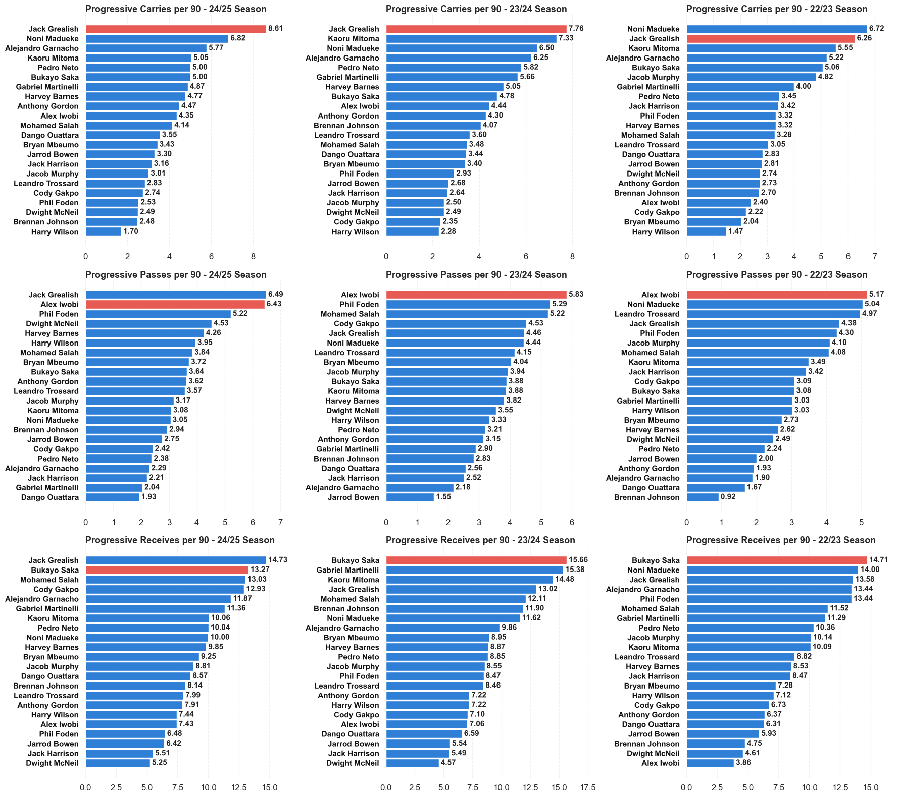
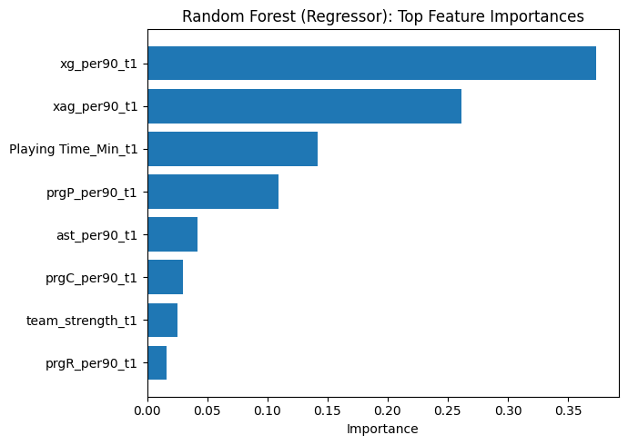
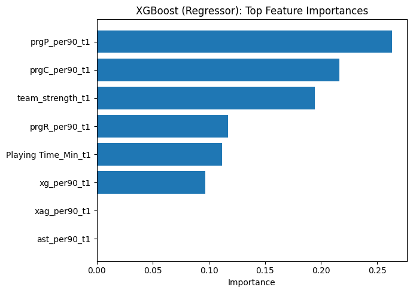
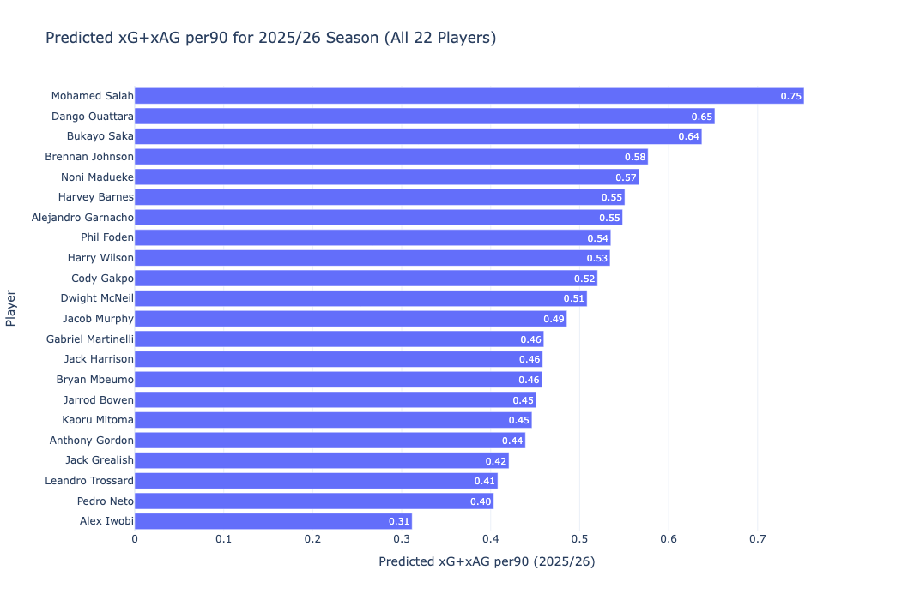

# Premier League Development Model ⚽
*A data-driven analysis of winger performance, archetypes, and predictive modelling across the Premier League.*

---

##  Project Overview  
This project builds an **end-to-end data science workflow** for evaluating and forecasting player development in the **Premier League**, with a focus on **wingers**.  
It integrates multi-season player data, clustering, and predictive modelling to uncover **performance archetypes**, **track individual progression**, and **forecast future output**.

By combining **feature engineering**, **PCA**, **K-Means clustering**, and **regression modelling**, the Premier League Development Model bridges **quantitative analysis** and **football intelligence** — providing **evidence-based insights** for scouting, recruitment, and performance development.

---

## Key Highlights  
- **Exploratory Data Analysis (EDA):**  
  Investigated distributions, positional trends, and relationships between attacking and progression metrics.  

- **Feature Engineering:**  
  Built lag features across three seasons, created per-90 metrics, normalised (z-scores), and filtered players with ≥500 minutes.  

- **Clustering & Archetypes (PCA + K-Means):**  
  Identified distinct winger profiles — including *Ball-Carrying Progressors*, *Creative Dribblers*, and *Direct Finishers*.  

- **Predictive Modelling:**  
  Used **Linear Regression** to forecast next-season `xG+xA per 90`, validating model performance and interpretability.  

- **Visualisation:**  
  Interactive PCA scatter plots and radar charts reveal stylistic differences across archetypes and player progression.  

---

## Project Objectives
- Develop an **end-to-end player development model** focused on Premier League wingers.  
- Apply **feature engineering** (per-90 metrics, lag variables, normalization, and filtering).  
- Identify **distinct player archetypes** using **PCA** and **K-Means clustering**.  
- Build and evaluate **predictive models** (Linear Regression and others) to forecast next-season attacking output (`xG+xA per 90`).  
- Communicate actionable insights and visuals to **analysts, scouts, and performance departments**.  

---

## Tech Stack
- **Language:** Python 3.12  
- **Libraries:** pandas, numpy, scikit-learn, plotly, matplotlib, seaborn  
- **Clustering & Modelling:** PCA, K-Means, Linear Regression  
- **Data Collection:** BeautifulSoup (web scraping from FBref)  
- **Environment:** Conda / venv  
- **Tools:** Jupyter Notebooks, GitHub, Visual Studio Code  

---

## Dataset Overview

| Feature | Description |
|----------|-------------|
| Player | Player name |
| season | Season in "YYYY-YYYY" format |
| Primary_Squad | Player’s main club during the season |
| Playing Time_Min | Total minutes played in the season |
| gls_per90 | Goals scored per 90 minutes |
| ast_per90 | Assists per 90 minutes |
| xg_per90 | Expected goals per 90 minutes |
| xag_per90 | Expected assists per 90 minutes |
| npxg_per90 | Non-penalty expected goals per 90 minutes |
| prgC_per90 | Progressive carries per 90 minutes |
| prgP_per90 | Progressive passes per 90 minutes |
| prgR_per90 | Progressive receives per 90 minutes |
| gls_per90_t1, ast_per90_t1, xg_per90_t1, etc. | Lagged features representing previous season performance |

---

## Exploratory Data Analysis (EDA)

### Player Output Efficiency Analysis (2024–25 Season)

#### Goals vs Expected Goals per 90

This chart compares each winger’s **Goals per 90** against their **Expected Goals (xG) per 90**, providing insight into finishing efficiency.

**Interpretation**
- The dashed diagonal line represents “expected performance” — players whose actual goals align perfectly with their xG.  
- Players above the line **outperform** their xG (elite finishers).  
- Players below the line **underperform**, suggesting weaker finishing or poor shot selection.

**Key Insights**
- **Mohamed Salah** stands out well above the line, showing elite and consistent finishing efficiency.  
- **Bryan Mbeumo** and **Harvey Barnes** also overperform xG, indicating strong shot conversion.  
- **Jack Harrison**, **Jack Grealish**, and **Pedro Neto** underperform, hinting at potential regression or inefficiency.  

> The overall correlation (r ≈ 0.8) suggests xG remains a strong predictor of goal output, though individual quality differentiates elite performers.

#### Assists vs Expected Assists per 90

This chart compares **Assists per 90** with **Expected Assists (xAG) per 90**, measuring creative efficiency — how well key passes are being converted into goals.

**Interpretation**
- The dashed line indicates expected creative output.  
- Players above the line **overperform** their xAG — strong assist conversion or elite teammates.  
- Players below the line **underperform**, meaning their chances aren’t being finished effectively.

**Key Insights**
- **Bukayo Saka**, **Mohamed Salah**, and **Jacob Murphy** outperform their xAG, reflecting efficient chance conversion.  
- **Dwight McNeil** also ranks high, providing valuable chance creation despite Everton’s overall struggles.  
- **Jack Harrison** again underperforms, mirroring his low finishing and assist efficiency.  

> Strong correlation (r ≈ 0.85) reinforces xAG as a robust measure of creative output.

### Player Output Efficiency Analysis (2023–24 Season)

#### Goals vs Expected Goals per 90

This chart compares each winger’s **Goals per 90** to **Expected Goals (xG) per 90**, illustrating how finishing quality and shot conversion evolved during the 2023–24 Premier League season.

**Key Insights**
- **Mohamed Salah** continues to perform at elite finishing levels, sitting far above the line — a hallmark of sustained world-class efficiency.  
- **Leandro Trossard**, **Phil Foden**, and **Harvey Barnes** also outperform their xG, demonstrating strong finishing consistency.  
- **Bryan Mbeumo** and **Bukayo Saka** remain slightly above expectation, showing reliable, repeatable performance.  
- **Jack Harrison**, **Dwight McNeil**, and **Dango Ouattara** underperform relative to xG, indicating lower shot efficiency or finishing struggles.

> Overall, a similar pattern to 2024–25 emerges — elite attackers consistently exceed expectation, underlining stable finishing skill rather than luck.

#### Assists vs Expected Assists per 90

This chart plots **Assists per 90** against **Expected Assists (xAG) per 90**, providing a view into creative efficiency and chance conversion from wide areas.

**Key Insights**
- **Jacob Murphy** and **Pedro Neto** emerge as standout creative overperformers, producing assists well beyond expectation.  
- **Mohamed Salah** and **Brennan Johnson** also exceed their xAG, reflecting strong chance creation combined with efficient finishing teammates.  
- **Harry Wilson** and **Anthony Gordon** record creative outputs slightly above expectation, showing consistent contribution in wide roles.  
- **Jack Grealish**, **Alex Iwobi**, and **Leandro Trossard** fall below the line, suggesting underperformance in chance conversion or limited creative freedom.

> The trends reinforce player consistency across seasons — those who outperform xAG tend to sustain creativity due to tactical role and decision-making rather than randomness.

### Player Output Efficiency Analysis (2022–23 Season)

#### Goals vs Expected Goals per 90

This chart evaluates **finishing efficiency** by comparing each winger’s **Goals per 90** to **Expected Goals (xG) per 90** during the 2022–23 season.

**Key Insights**
- **Mohamed Salah** again demonstrates elite efficiency, finishing far above expectation — confirming his consistency across multiple seasons.  
- **Alejandro Garnacho**, **Phil Foden**, and **Gabriel Martinelli** also significantly overperform xG, indicating clinical finishing and sharp decision-making in front of goal.  
- **Harvey Barnes**, **Bukayo Saka**, and **Cody Gakpo** align closely with expected values, showing steady and reliable performance.  
- **Pedro Neto** and **Alex Iwobi** underperform their xG, reflecting potential inefficiencies or weaker shot selection.  

> Salah’s sustained overperformance across years underscores a genuine skill advantage, not random variance — an important validation for player development models.

#### Assists vs Expected Assists per 90

This visualization measures **creative efficiency**, comparing **Assists per 90** to **Expected Assists (xAG) per 90**.

**Key Insights**
- **Leandro Trossard** stands out as a major overperformer, generating assists well above expectation.  
- **Mohamed Salah**, **Alejandro Garnacho**, and **Bukayo Saka** also surpass xAG — signalling elite combination play and creative synergy.  
- **Jack Grealish** and **Phil Foden** perform in line with expectations, showing reliable creative roles.  
- **Gabriel Martinelli** and **Dwight McNeil** slightly underperform, likely due to missed chances from teammates.  
- **Pedro Neto** and **Noni Madueke** rank lowest, highlighting reduced creative end-product or tactical limitations.  

> The creative efficiency trends align with finishing outcomes — suggesting that both scoring and assisting ability follow consistent player archetypes over time.

### Predictive Outlook for 2025–26

**Mohamed Salah — World-Class Standard**

- Three consecutive seasons of outperforming both xG and xAG indicate sustainable excellence.
- His per-90 metrics remain elite across all attacking facets — volume, efficiency, and consistency.
- Expect continued high output barring age-related decline; regression unlikely given his historical overperformance stability.

**Bukayo Saka — Approaching Elite Tier**

- Consistent creative overperformance across seasons suggests natural playmaking growth.
- Slightly underperforms xG at times, but shot volume and involvement trends point to a strong upward trajectory.
- Likely to push closer to Salah’s production tier in 2025–26.

**Phil Foden & Leandro Trossard — High-Efficiency Finishers**

- Both have sustained finishing quality above xG for multiple seasons.
- Foden’s goal contribution profile aligns with prime-age breakout potential; expect another efficient season with potential xG+xA growth.

**Harvey Barnes & Bryan Mbeumo — Reliable Output Profiles**

- Repeat overperformers in finishing metrics; maintain solid per-90 returns with efficient shot selection.
- Projected 2025–26 outputs should mirror recent averages unless club dynamics change.

**Emerging/Volatile Profiles**

- Gabriel Martinelli and Alejandro Garnacho exhibit volatility typical of younger wingers, flashes of elite finishing offset by inconsistency.

### Progressive Actions Analysis (2022/23 – 2024/25 Seasons)

This section analyses player progression metrics — **Progressive Carries**, **Progressive Passes**, and **Progressive Receives per 90** — across three Premier League seasons.  
These metrics highlight players’ ability to **advance possession**, **break lines**, and **receive the ball in attacking zones**, key indicators of modern winger effectiveness.

#### Progressive Carries per 90
- **Jack Grealish** leads this metric across all three seasons: *6.7 (22/23)*, *6.5 (23/24)*, and *6.6 (24/25)*.  
- He’s the only player to remain in the **top two every year**, reflecting his pivotal role in carrying the ball forward and driving possession into advanced areas.  
- **Bukayo Saka** and **Noni Madueke** are next most consistent, both ranking within the **top five** in multiple seasons.  
- **Kaoru Mitoma** and **Gabriel Martinelli** fluctuate slightly but consistently demonstrate strong carrying ability.

> Progressive carries capture directness and dribbling involvement — attributes often linked to *creative progressors* and *ball-dominant wingers*.

#### Progressive Passes per 90
- **Jack Grealish** again ranks among the top three each season (range: *4.6–6.5*), showcasing his dual threat as both ball carrier and creator.  
- **Alex Iwobi** emerges as a **key progressive passer**, leading or close to the lead in each season — particularly dominant in *2023/24* and *2024/25*.  
- **Leandro Trossard** and **Phil Foden** show steady creative progression but with more seasonal variability.  

> Consistency in progressive passing highlights players who *dictate attacking flow* and *advance play through smart distribution*.

#### Progressive Receives per 90
- **Bukayo Saka** dominates this category across all three seasons, ranking **1st or 2nd each year**, underlining elite **off-ball movement** and **positional intelligence**.  
- **Jack Grealish** and **Gabriel Martinelli** remain regulars in the upper tier, reflecting their involvement in advanced build-up and attacking phases.  
- **Mohamed Salah** and **Alejandro Garnacho** display steady improvement, suggesting increased offensive involvement and tactical maturity.

> High progressive receives values identify players adept at *finding space*, *linking play*, and *maintaining attacking width*.

#### Summary
- **Grealish** stands out as a complete progressor — excelling in carries, passes, and receives across three years.  
- **Saka** continues to lead as an elite receiver, highlighting movement and positioning as his key strengths.  
- **Iwobi**’s progression underscores his playmaking evolution and adaptability across systems.  
- The trio of **Grealish, Saka, and Martinelli** exemplifies sustained attacking involvement — key indicators for player development and role archetype analysis.

---

### Team Strength Feature Engineering

#### **Overview**
To capture the contextual influence of a player’s club environment, a **team strength** feature was engineered for each Premier League season (*2022/23 – 2024/25*).  
This variable quantifies the **relative quality of each club** based on its final league position, enabling the model to account for environmental factors that impact player output.

#### **Calculation**
Team strength was derived from the club’s final league rank using the following formula:

\[
\text{team_strength} = \frac{21 - \text{Rank}}{20}
\]

- Teams finishing **1st** receive a value of **1.00** (strongest).  
- Teams finishing **20th** receive a value of **0.05** (weakest).  

This ensures a continuous variable representing club quality across all seasons.

#### **Purpose**
Incorporating team strength provides important context for interpreting player metrics and model predictions.  
Players in stronger teams tend to produce higher attacking outputs due to:
- Greater **possession share** and territorial dominance  
- **Higher tactical cohesion** and teammate quality  
- Increased **chance creation** and attacking opportunities  

To reduce short-term volatility (e.g., managerial changes or over/underperformance), a **rolling average** was applied to smooth club-level trends and reflect sustained team strength.

#### **Imputing Team Strength for Newly Promoted Clubs**
For the **2025–26 season**, newly promoted teams lacked prior Premier League rankings.  
To maintain numerical consistency, a **default team_strength value of 0.20** (equivalent to a 17th-place finish) was assigned to these clubs.  

> This approach preserves model integrity by ensuring all players have comparable contextual features, even from newly promoted sides.

---

## Model Evaluation

The goal of the predictive modelling stage was to forecast **next-season attacking contribution** (`xG+xAG per90`) using lagged features (e.g., `xG_per90_t1`, `xAG_per90_t1`, `team_strength_t1`, progressive metrics, etc.).

### Linear Regression

**Metrics**
- **MAE:** 0.11 → on average, predictions are off by ~0.11 `xG+xAG per90`
- **MSE:** Moderate, consistent with MAE
- **R²:** 0.27 → model explains ~27% of the variance in next-season attacking output

**Interpretation**
- Captures general direction — higher xG+xAG players are predicted higher.  
- Some over/under-estimation visible (points deviating from the diagonal).  
- Linear structure captures part of the signal but misses some non-linear patterns.  
- Residuals are centered near zero → no major systematic bias.  
- Variation across predicted values suggests limited generalization — some players overpredicted, others underpredicted.

> The linear baseline establishes a strong interpretable foundation — effective but constrained by linear assumptions and small sample size.

### Random Forest Regressor

**Test Metrics**
- **MAE:** 0.1102  
- **RMSE:** 0.1426  
- **R²:** 0.03  

**Interpretation**
- The tuned Random Forest does **not outperform** the linear baseline (R² ≈ 0.03 vs 0.27).  
- Likely limited by the **small dataset size**, **target noise**, and **cross-validation variance**.  
- Ensemble models like RF can **overfit** subtle, non-generalizable patterns when data is sparse.

**Feature Importance**
- Next-season output is driven most by **previous season xG and xAG** — process metrics are stronger than raw outcomes.  
- **Minutes** and **progressive passing** contribute contextual information but with smaller weights.  

> Despite weak test performance, Random Forest offers interpretability — confirming that *chance quality (xG/xAG)* remains the dominant driver of future attacking performance.

### XGBoost Regressor

**Test Metrics**
- **MAE:** 0.1103  
- **RMSE:** 0.1429  
- **R²:** 0.03  

**Interpretation**
- Performs similarly to Random Forest and slightly worse than Linear Regression.  
- Indicates **limited nonlinear structure** — the dataset’s signal is mostly linear.  
- Predictions cluster narrowly → mild underfitting due to small data range.  
- Residuals center around zero → unbiased but low variance explained.

**Feature Importance**
- XGBoost prioritizes **progressive actions** (`prgP`, `prgC`, `prgR`) and **team strength**, over pure goal metrics.  
- Suggests the model learns how **creative contribution and environment** influence expected goal involvement.  

> The emphasis on **progressive play** and **team context** aligns with tactical intuition — players who advance possession and play in stronger teams tend to sustain higher expected outputs.

### Summary
| Model | MAE | RMSE | R² | Key Takeaways |
|--------|------|------|----|----------------|
| **Linear Regression** | 0.11 | 0.14 | **0.27** | Baseline interpretable model; captures main linear trends |
| **Random Forest** | 0.11 | 0.14 | 0.03 | Slight overfitting; xG/xAG dominate importance |
| **XGBoost** | 0.11 | 0.14 | 0.03 | Underfitted; emphasizes progressive play + team context |

### Key Insights
- Linear regression remains the most stable given the data volume and feature set.  
- Ensemble models (RF/XGBoost) reveal **important contextual drivers** even without performance gains.  
- Predictive power is limited by **small sample size**, but the framework demonstrates scalability for future richer datasets.  
- Future work should include **event-level data**, **expanded player samples**, and **multiseason predictive pipelines** for improved generalization.

---

## Predicted xG+xAG per90 — 2025/26 Season (Linear Regression)

Using the **Linear Regression** model trained on *2023/24 → 2024/25* transitions, the *2024/25 season metrics* were input to project each winger’s **expected goal + assist contribution per 90 minutes** for the upcoming *2025/26 Premier League season*.

| Rank | Player | Predicted xG+xAG per90 (25/26) |
|:--:|:----------------|:----------------:|
| 1️⃣ | **Mohamed Salah** | **0.75** |
| 2️⃣ | **Dango Ouattara** | **0.65** |
| 3️⃣ | **Bukayo Saka** | **0.64** |
| 4️⃣ | **Brennan Johnson** | 0.58 |
| 5️⃣ | **Noni Madueke** | 0.57 |
| … | *(remaining 17 players range 0.55 → 0.31)* |  |

---

### Interpretation

- **Dango Ouattara** emerges as the **stand-out surprise**, ranking second overall behind **Mohamed Salah**.  
  His underlying 2024/25 metrics — especially *progressive carries* and *passes* — drive a higher-than-expected projection, indicating significant attacking potential for 2025/26.  
- **Elite consistency** continues for **Salah** and **Saka**, whose balanced xG/xAG profiles maintain top-tier output forecasts.  
- The **middle group** (Johnson, Madueke, Barnes, Garnacho, Foden) projects **steady year-on-year growth**, with solid creative and progression numbers supporting sustained performance.  
- **Lower-ranked outputs** (e.g., Alex Iwobi, Pedro Neto) reflect reduced shooting volume or weaker *team strength* inputs — emphasizing the contextual effect of team environment on predictive outcomes.  

> The predicted range (~0.31–0.75 xG+xAG per90) remains moderate, consistent with the model’s **linear structure** and the compact distribution of winger performance in the Premier League.
> 

### Insights for Player Development
- The projection identifies **potential breakout candidates** (Ouattara, Madueke) versus established performers (Salah, Saka).  
- Combining **model forecasts** with **archetype clustering** (e.g., creative vs direct wingers) enhances scouting and tactical analysis.  
- Clubs could use this framework to **prioritize signings or developmental focus areas** aligned with model-identified growth profiles.

The **Linear Regression** model balances **interpretability with signal**, identifying **Dango Ouattara** and **Noni Madueke** as *high-upside profiles* before their high-profile 2025/26 transfers.

- **Dango Ouattara’s** projection as Brentford’s **club-record signing** is particularly notable, considering how heavily Brentford rely on **data-driven recruitment**.  
  His strong underlying progression metrics suggest that the model correctly anticipates his potential to thrive in a system emphasizing **transitional and efficiency-based attacking patterns**.  
- **Noni Madueke’s** transfer to **Arsenal** is another intriguing case — his predicted upside highlights how **underlying metrics** (progressive actions, expected assists) may reveal untapped potential that traditional statistics overlook.  
  In a possession-oriented environment, these attributes could translate into substantial attacking gains.

> These case studies demonstrate how **interpretable models** can bridge the gap between statistical projections and **real-world football decisions**, highlighting players whose profiles align with evolving tactical systems and recruitment philosophies.

---
